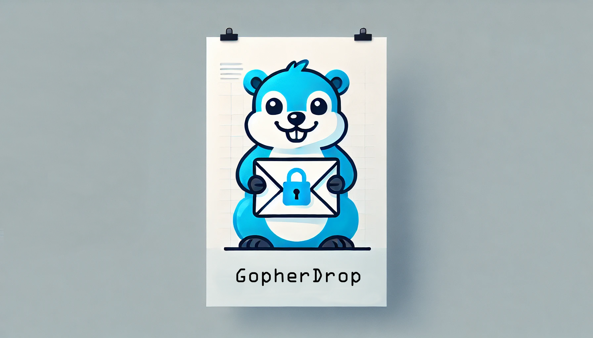

Here's the updated **README** with the requested changes:  
- **Removed** the "Security Best Practices" section.  
- **Updated** PostgreSQL to use a more recent version.  
- **Removed** the `version` key from `docker-compose.yaml`.  
- **Added** instructions on how to use a `.env` file to store secrets.

---

# 🛠️ **GopherDrop** – Secure One-Time Secret Sharing 🏁

GopherDrop is a secure, self-hostable REST API and UI for sharing encrypted one-time secrets and files, inspired by Bitwarden's Send feature. Built with **Go**, **Vue.js**, and **Vuetify**, GopherDrop is designed for simplicity, security, and ease of deployment.



---

## 📋 **Table of Contents**

1. [Features](#-features)  
2. [Installation](#-installation)  
3. [Build and Run](#️-build-and-run)  
4. [Configuration](#️-configuration)  
5. [Endpoints](#️-endpoints)  
6. [Docker Deployment](#-docker-deployment)  
7. [Persistence](#-persistence)  
8. [Reverse Proxy Support](#-reverse-proxy-support)  
9. [Contributing](#-contributing)  
10. [License](#-license)  
11. [Community and Support](#-community-and-support)  

---

## 🌟 **Features**

- **Send Text or Files**: Share sensitive information securely.  
- **Password Protection**: Encrypt your secrets with a password.  
- **One-Time Retrieval**: Automatically delete secrets after a single access.  
- **Expiration Settings**: Define how long a secret remains available.  
- **Responsive UI**: Built with Vue.js and Vuetify for a modern user experience.  
- **Dockerized Deployment**: Simple setup with Docker and Docker Compose.  
- **Production and Debug Modes**: Easily switch between production and debug builds.  

---

## 📥 **Installation**

### **Prerequisites**

- **Docker**: [Install Docker](https://docs.docker.com/get-docker/)  
- **Docker Compose**: [Install Docker Compose](https://docs.docker.com/compose/install/)  

### **Clone the Repository**

```bash
git clone https://github.com/kek-Sec/gopherdrop.git
cd gopherdrop
```

---

## 🛠️ **Build and Run**

### **Production Setup**

To build and run GopherDrop in production mode:

```bash
make build      # Build the Docker images
make up         # Start the backend, frontend, and database services
```

### **Debug Setup**

To build and run GopherDrop in debug mode:

```bash
make build-debug   # Build the Docker images with debug mode enabled
make up            # Start the backend, frontend, and database services in debug mode
```

### **Stopping Services**

```bash
make down
```

### **Running Tests**

```bash
make test
```

### **Access the Application**

- **UI**: `http://localhost:8081`  
- **API**: `http://localhost:8080`  

---

## ⚙️ **Configuration**

### **Using `.env` File**

Create a `.env` file in the project root to securely store your secrets:

```env
DB_HOST=db
DB_USER=user
DB_PASSWORD=pass
DB_NAME=gopherdropdb
DB_SSLMODE=disable
SECRET_KEY=supersecretkeysupersecretkey32
LISTEN_ADDR=:8080
STORAGE_PATH=/app/storage
MAX_FILE_SIZE=10485760
```

### **Environment Variables**

| Variable         | Description                     | Default Value                        |
|------------------|---------------------------------|--------------------------------------|
| `DB_HOST`        | Database host                   | `db`                                |
| `DB_USER`        | Database username               | `user`                              |
| `DB_PASSWORD`    | Database password               | `pass`                              |
| `DB_NAME`        | Database name                   | `gopherdropdb`                      |
| `SECRET_KEY`     | Secret key for encryption       | `supersecretkeysupersecretkey32`    |
| `LISTEN_ADDR`    | API listen address              | `:8080`                             |
| `STORAGE_PATH`   | Path for storing uploaded files | `/app/storage`                      |
| `MAX_FILE_SIZE`  | Maximum file size in bytes      | `10485760` (10 MB)                  |

---

## 🖥️ **Endpoints**

### **API Endpoints**

| Method | Endpoint           | Description                              |
|--------|--------------------|------------------------------------------|
| `POST` | `/send`            | Create a new send (text or file)         |
| `GET`  | `/send/:id`        | Retrieve a send by its hash              |
| `GET`  | `/send/:id/check`  | Check if a send requires a password      |

### **Example: Create a Send**

```bash
curl -X POST http://localhost:8080/send \
  -F "type=text" \
  -F "data=This is a secret message" \
  -F "password=mysecurepassword"
```

---

## 🐳 **Docker Deployment**

### **Production `docker-compose.yml`**

> docker-compose.prod.sample.yaml

---

## 🌐 **Reverse Proxy Support**

### **Nginx Configuration**

Create a `nginx.conf`:

```nginx
server {
  listen 80;

  location / {
    proxy_pass http://frontend:80;
  }

  location /api/ {
    proxy_pass http://backend:8080/;
  }
}
```

### **Traefik Configuration**

Add this to `docker-compose.yml`:

```yaml
labels:
  - "traefik.enable=true"
  - "traefik.http.routers.gopherdrop.rule=Host(`example.com`)"
  - "traefik.http.services.gopherdrop.loadbalancer.server.port=8080"
```

---

## 🤝 **Contributing**

1. Fork the repository.  
2. Create a new branch: `git checkout -b my-feature-branch`  
3. Make your changes and add tests.  
4. Submit a pull request.  

---

## 📝 **License**

GopherDrop is licensed under the [MIT License](LICENSE).

---

## 💬 **Community and Support**

- **Issues**: [GitHub Issues](https://github.com/kek-Sec/gopherdrop/issues)  
- **Discussions**: [GitHub Discussions](https://github.com/kek-Sec/gopherdrop/discussions)  
