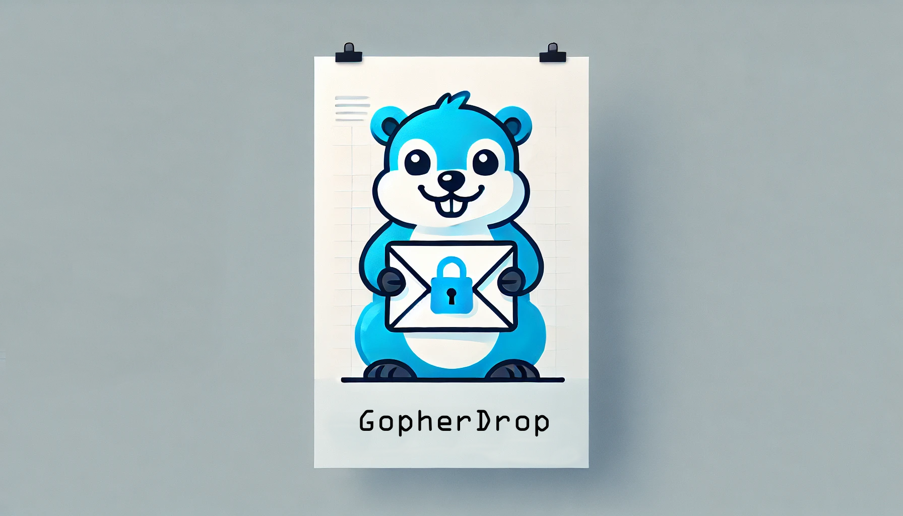

# 🛠️ **GopherDrop** – Secure One-Time Secret Sharing 🏁


### Demo: [https://gopherdrop.yup.gr](http://gopherdrop.yup.gr)

GopherDrop is a secure, self-hostable REST API and UI for sharing encrypted one-time secrets and files, inspired by Bitwarden's Send feature. Built with **Go**, **Vue.js**, and **Vuetify**, GopherDrop is designed for simplicity, security, and ease of deployment.



---

## 📋 **Table of Contents**

1. [Features](#-features)
2. [Installation](#-installation)
3. [Build and Run](#-build-and-run)
4. [Configuration](#-configuration)
5. [Endpoints](#-endpoints)
6. [Docker Deployment](#-docker-deployment)
7. [Contributing](#-contributing)
8. [License](#-license)
9. [Community and Support](#-community-and-support)

---

## 🌟 **Features**

- **Send Text or Files**: Share sensitive information securely.
- **Password Protection**: Encrypt your secrets with a password.
- **One-Time Retrieval**: Automatically delete secrets after a single access.
- **Expiration Settings**: Define how long a secret remains available.
- **Responsive UI**: Built with Vue.js and Vuetify for a modern user experience.
- **Dockerized Deployment**: Simple setup with Docker and Docker Compose.
- **Production and Debug Modes**: Easily switch between production and debug builds.


---

## 🐳 **Docker Deployment**

### **Production `docker-compose.yml`**

> docker-compose.prod.sample.yaml

---

## 📥 **Installation**

### **Prerequisites**

- **Docker**: [Install Docker](https://docs.docker.com/get-docker/)
- **Docker Compose**: [Install Docker Compose](https://docs.docker.com/compose/install/)

### **Clone the Repository**

```bash
git clone https://github.com/kek-Sec/gopherdrop.git
cd gopherdrop
```
---

## 🛠️ **Build and Run**

### **Local Setup**

To build and run GopherDrop in production mode:

```bash
make build      # Build the Docker images
make up         # Start the backend, frontend, and database services
```

### **Debug Setup**

To build and run GopherDrop in debug mode:

```bash
make build-debug   # Build the Docker images with debug mode enabled
make up            # Start the backend, frontend, and database services in debug mode
```

### **Stopping Services**

```bash
make down
```

### **Running Tests**

```bash
make test
```

## ⚙️ **Configuration**

### **Using `.env` File**

Create a `.env` file in the project root to securely store your secrets:

```env
DB_HOST=db
DB_USER=user
DB_PASSWORD=pass
DB_NAME=gopherdropdb
DB_SSLMODE=disable
SECRET_KEY=supersecretkeysupersecretkey32
LISTEN_ADDR=:8080
STORAGE_PATH=/app/storage
MAX_FILE_SIZE=10485760
```

### **Environment Variables**

| Variable         | Description                     | Default Value                        |
|------------------|---------------------------------|--------------------------------------|
| `DB_HOST`        | Database host                   | `db`                                |
| `DB_USER`        | Database username               | `user`                              |
| `DB_PASSWORD`    | Database password               | `pass`                              |
| `DB_NAME`        | Database name                   | `gopherdropdb`                      |
| `SECRET_KEY`     | Secret key for encryption       | `supersecretkeysupersecretkey32`    |
| `LISTEN_ADDR`    | API listen address              | `:8080`                             |
| `STORAGE_PATH`   | Path for storing uploaded files | `/app/storage`                      |
| `MAX_FILE_SIZE`  | Maximum file size in bytes      | `10485760` (10 MB)                  |

### **Build Arguments**

| Argument             | Description                          | Default Value                                |
|----------------------|--------------------------------------|----------------------------------------------|
| `VITE_API_URL`       | API endpoint URL                     | `/api`                                       |
| `VITE_APP_TITLE`     | Custom application title             | `GopherDrop`                                 |
| `VITE_APP_DESCRIPTION` | Custom application description     | `Secure one-time secret and file sharing`    |
| `DEBUG`              | Enable debug mode                    | `false`                                      |
| `GIN_MODE`           | Gin framework mode                   | `release`                                    |
| `VERSION`            | Application version                  | `-`                                          |

---

## 🖥️ **Endpoints**

### **API Endpoints**

| Method | Endpoint           | Description                              |
|--------|--------------------|------------------------------------------|
| `POST` | `/send`            | Create a new send (text or file)         |
| `POST` | `/send/text`       | Create a text send (curl-friendly)       |
| `POST` | `/send/file`       | Create a file send (curl-friendly)       |
| `GET`  | `/send/:id`        | Retrieve a send by its hash              |
| `GET`  | `/send/:id/check`  | Check if a send requires a password      |

### **curl Examples**

Base URL:

```bash
BASE_URL="http://localhost:8080"
```

Create a text paste from a raw request body:

```bash
curl -sS \
  -X POST "$BASE_URL/send/text?expires=24h&onetime=true&password=my-pass" \
  -H "Content-Type: text/plain" \
  --data-binary "my secret text"
```

Create a text paste using form data:

```bash
curl -sS \
  -X POST "$BASE_URL/send/text" \
  -d "data=my secret text" \
  -d "expires=24h" \
  -d "onetime=true"
```

Create a file paste with multipart upload:

```bash
curl -sS \
  -X POST "$BASE_URL/send/file?expires=24h&onetime=true&password=my-pass" \
  -F "file=@./secret.pdf"
```

Create a file paste from raw binary (no multipart):

```bash
curl -sS \
  -X POST "$BASE_URL/send/file?filename=secret.pdf&expires=24h" \
  -H "Content-Type: application/octet-stream" \
  --data-binary "@./secret.pdf"
```

Backward-compatible create endpoint (`/send`) still works with `type=text` or `type=file`.

Response shape for create endpoints:

```json
{"hash":"<send-hash>"}
```

Extract hash and print a ready-to-share URL:

```bash
HASH=$(curl -sS -X POST "$BASE_URL/send/text" --data-binary "my secret" | jq -r '.hash')
echo "$BASE_URL/send/$HASH"
```

Create options accepted on all create endpoints:
- `password`: Optional decryption password.
- `onetime`: `true` or `false`.
- `expires`: Go duration format (examples: `30m`, `24h`, `7d` is not valid; use `168h`).


---

## 🤝 **Contributing**

1. Fork the repository.
2. Create a new branch: `git checkout -b my-feature-branch`
3. Make your changes and add tests.
4. Submit a pull request.

---

## 📝 **License**

GopherDrop is licensed under the [MIT License](LICENSE).

---

## 💬 **Community and Support**

- **Issues**: [GitHub Issues](https://github.com/kek-Sec/gopherdrop/issues)
- **Discussions**: [GitHub Discussions](https://github.com/kek-Sec/gopherdrop/discussions)
